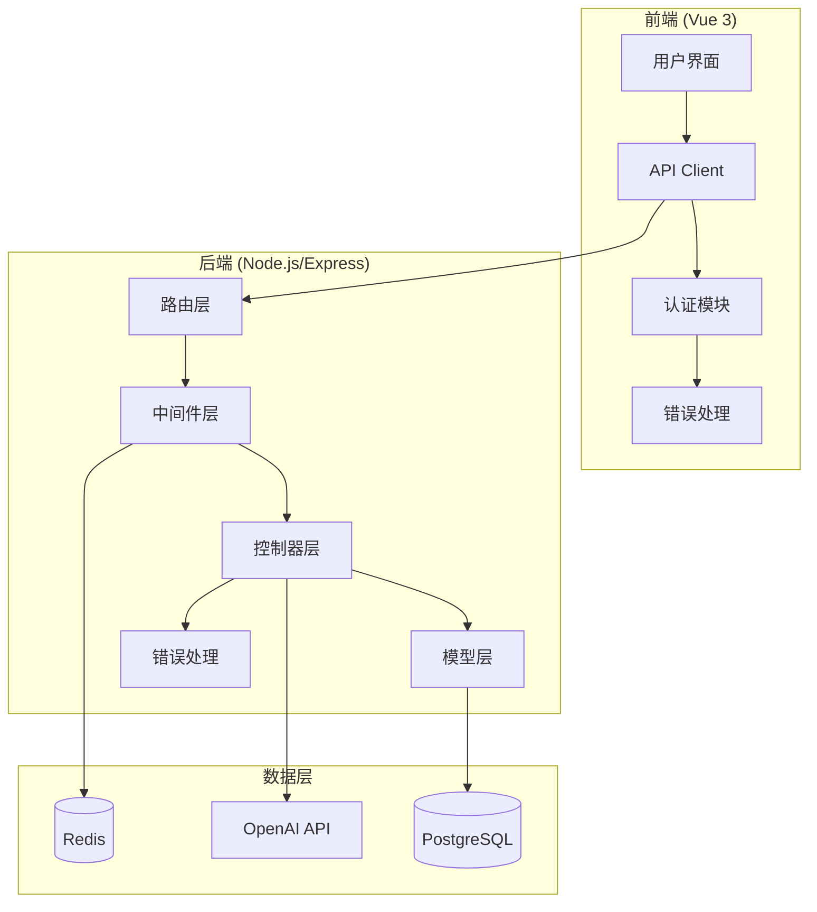
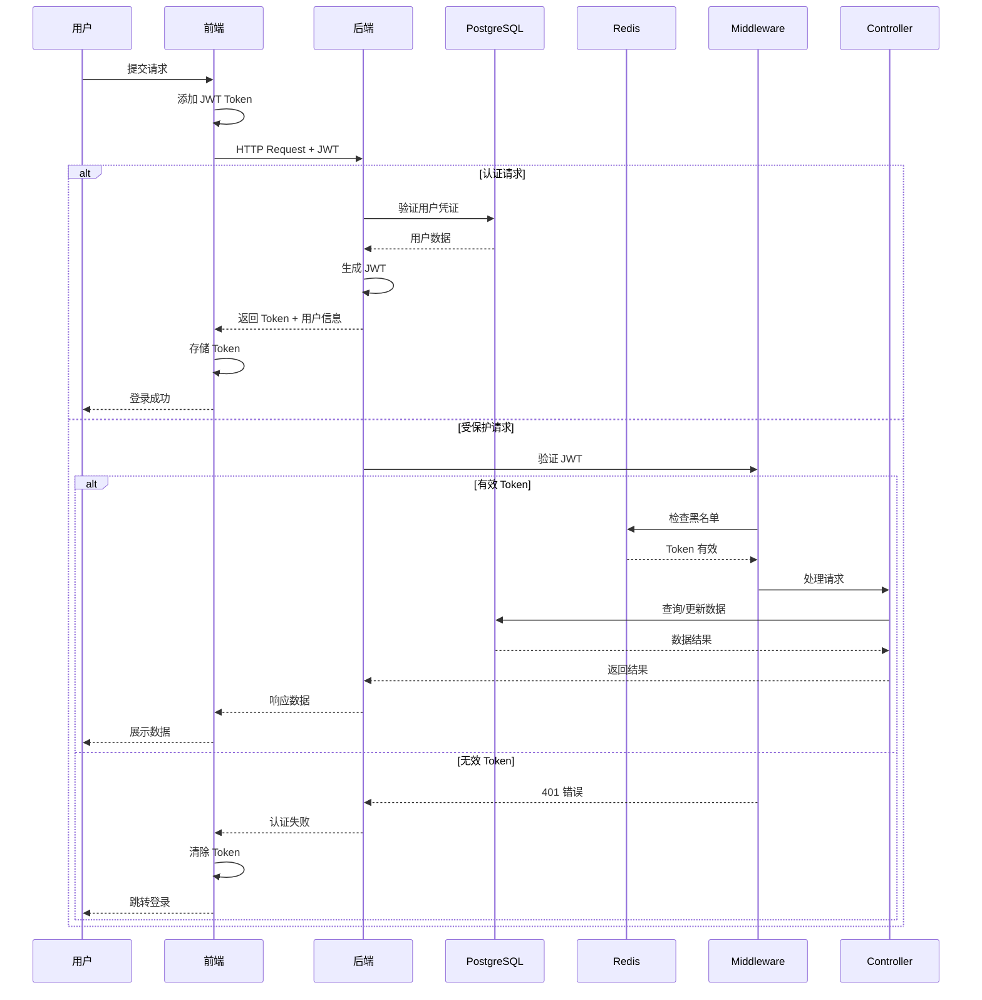
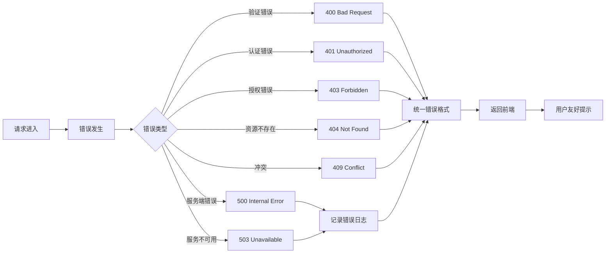

# API 对接、认证与测试技术设计

Feature Name: api-integration-auth
Updated: 2026-05-24

## Description

本设计文档定义 EnglishAI 平台前后端 API 对接、用户认证系统、错误处理机制和单元测试的技术实现方案。设计目标是提供安全、可靠、可扩展的 API 服务，确保前后端数据交互的完整性和一致性。

## Architecture

### 系统架构图



### 请求处理流程



### 错误处理流程



## Components and Interfaces

### 1. 后端组件

#### 1.1 认证中间件 (`middleware/auth.middleware.ts`)

```typescript
interface AuthRequest extends Request {
  user?: {
    userId: number;
    email: string;
  };
}

interface JWTPayload {
  userId: number;
  email: string;
  iat: number;
  exp: number;
}
```

**职责**:
- 验证 JWT 令牌格式和签名
- 检查令牌是否在黑名单中
- 解析用户信息并附加到请求对象
- 处理令牌过期和无效情况

#### 1.2 错误处理中间件 (`middleware/error.middleware.ts`)

```typescript
interface AppError extends Error {
  statusCode?: number;
  errorCode?: string;
  isOperational?: boolean;
  details?: Record<string, string>;
}

interface ErrorResponse {
  success: false;
  error: {
    code: string;
    message: string;
    details?: Record<string, string>;
  };
}
```

**错误码定义**:
```typescript
// 认证错误 (AUTH_*)
AUTH_TOKEN_MISSING = 'AUTH_TOKEN_MISSING'
AUTH_TOKEN_INVALID = 'AUTH_TOKEN_INVALID'
AUTH_TOKEN_EXPIRED = 'AUTH_TOKEN_EXPIRED'
AUTH_CREDENTIALS_INVALID = 'AUTH_CREDENTIALS_INVALID'
AUTH_ACCOUNT_LOCKED = 'AUTH_ACCOUNT_LOCKED'

// 验证错误 (VALIDATION_*)
VALIDATION_EMAIL_INVALID = 'VALIDATION_EMAIL_INVALID'
VALIDATION_PASSWORD_WEAK = 'VALIDATION_PASSWORD_WEAK'
VALIDATION_FIELD_REQUIRED = 'VALIDATION_FIELD_REQUIRED'
VALIDATION_EMAIL_EXISTS = 'VALIDATION_EMAIL_EXISTS'

// 资源错误 (RESOURCE_*)
RESOURCE_NOT_FOUND = 'RESOURCE_NOT_FOUND'
RESOURCE_CONFLICT = 'RESOURCE_CONFLICT'

// 系统错误 (SYSTEM_*)
SYSTEM_INTERNAL_ERROR = 'SYSTEM_INTERNAL_ERROR'
SYSTEM_SERVICE_UNAVAILABLE = 'SYSTEM_SERVICE_UNAVAILABLE'
SYSTEM_DATABASE_ERROR = 'SYSTEM_DATABASE_ERROR'
```

#### 1.3 控制器层

| 控制器 | 路由 | 方法 |
|--------|------|------|
| `auth.controller.ts` | `/api/auth/*` | register, login, refreshToken, logout |
| `user.controller.ts` | `/api/users/*` | getProfile, updateProfile, getProgress, getStatistics |
| `lesson.controller.ts` | `/api/lessons/*` | getAll, getById, getSentences, updateProgress |
| `ai.controller.ts` | `/api/ai/*` | chat, writingAssessment, sentenceAnalysis, speakingEvaluation |

#### 1.4 路由定义 (`routes/index.ts`)

```typescript
// 路由结构
const router = Router();

// 公开路由
router.post('/auth/register', register);
router.post('/auth/login', login);
router.post('/auth/refresh', refreshToken);

// 受保护路由
router.use(authMiddleware); // JWT 验证
router.post('/auth/logout', logout);
router.get('/users/profile', getProfile);
router.get('/users/progress', getProgress);
router.get('/lessons', getAllLessons);
// ... 其他路由
```

### 2. 前端组件

#### 2.1 API 客户端 (`src/api/index.ts`)

```typescript
interface ApiResponse<T> {
  success: boolean;
  data?: T;
  error?: {
    code: string;
    message: string;
    details?: Record<string, string>;
  };
}

interface ApiClient {
  get<T>(url: string): Promise<ApiResponse<T>>;
  post<T>(url: string, data: any): Promise<ApiResponse<T>>;
  put<T>(url: string, data: any): Promise<ApiResponse<T>>;
  delete<T>(url: string): Promise<ApiResponse<T>>;
}
```

#### 2.2 认证模块 (`src/composables/useAuth.ts`)

```typescript
interface User {
  id: number;
  email: string;
  username: string;
  avatar?: string;
  level?: string;
}

interface AuthState {
  user: User | null;
  token: string | null;
  isAuthenticated: boolean;
}

interface UseAuthReturn {
  login: (email: string, password: string) => Promise<void>;
  register: (email: string, password: string, username: string) => Promise<void>;
  logout: () => void;
  refresh: () => Promise<void>;
  user: ComputedRef<User | null>;
  isAuthenticated: ComputedRef<boolean>;
}
```

#### 2.3 错误处理器 (`src/lib/errorHandler.ts`)

```typescript
type ErrorLevel = 'info' | 'warning' | 'error';

interface ErrorConfig {
  level: ErrorLevel;
  userMessage: string;
  logDetails: boolean;
  retryable: boolean;
}

const errorConfig: Record<string, ErrorConfig> = {
  'AUTH_TOKEN_EXPIRED': { level: 'info', userMessage: '登录已过期，请重新登录', logDetails: false, retryable: false },
  'SYSTEM_SERVICE_UNAVAILABLE': { level: 'warning', userMessage: '服务暂时不可用，请稍后重试', logDetails: true, retryable: true },
  // ... 其他错误配置
};
```

### 3. 数据库模型

#### 3.1 扩展用户表

```sql
ALTER TABLE users ADD COLUMN failed_login_attempts INTEGER DEFAULT 0;
ALTER TABLE users ADD COLUMN locked_until TIMESTAMP NULL;
```

#### 3.2 令牌黑名单表 (Redis)

```typescript
interface TokenBlacklist {
  token: string;          // Redis Key: blacklist:{token}
  blacklistedAt: number;  // 加入黑名单时间戳
  expiresAt: number;      // 原令牌过期时间
}
// TTL 设置为令牌剩余有效期
```

## Data Models

### API 请求/响应模型

```typescript
// 通用响应包装器
interface ApiSuccessResponse<T> {
  success: true;
  data: T;
}

interface ApiErrorResponse {
  success: false;
  error: {
    code: string;
    message: string;
    details?: Record<string, any>;
  };
}

type ApiResponse<T> = ApiSuccessResponse<T> | ApiErrorResponse;

// 注册请求
interface RegisterRequest {
  email: string;      // 符合 RFC 5322 格式
  password: string;   // 最少 8 位
  username: string;   // 3-20 字符
}

interface RegisterResponse {
  token: string;
  user: {
    id: number;
    email: string;
    username: string;
  };
}

// 登录请求
interface LoginRequest {
  email: string;
  password: string;
}

interface LoginResponse {
  token: string;
  user: {
    id: number;
    email: string;
    username: string;
  };
}

// 令牌刷新
interface RefreshTokenRequest {
  token: string;
}

interface RefreshTokenResponse {
  token: string;
}
```

## Correctness Properties

### 不变量

1. **密码永不返回**: 任何 API 响应永远不包含用户密码字段
2. **JWT 签名验证**: 所有 JWT 令牌必须使用服务器密钥验证签名
3. **事务完整性**: 涉及多表更新的数据库操作必须使用事务
4. **错误日志完整性**: 所有 5xx 错误必须记录详细堆栈追踪

### 边界条件

1. **并发登录**: 同一账户允许多个设备同时登录，但会话独立管理
2. **令牌刷新窗口**: 令牌过期后 24 小时内允许刷新，超过 24 小时需重新登录
3. **账户锁定恢复**: 锁定 15 分钟后自动解除，失败计数重置
4. **请求速率限制**: 单 IP 每分钟最多 100 次 API 请求，超过返回 429

### 安全约束

1. **SQL 注入防护**: 所有数据库查询必须使用参数化查询
2. **XSS 防护**: 所有用户输入必须转义后存储和输出
3. **CSRF 防护**: 敏感操作（修改密码、删除账户）需要额外验证
4. **敏感信息脱敏**: 日志中的邮箱、Token 必须部分脱敏

## Error Handling

### 错误处理策略

```typescript
// 后端错误处理中间件
interface ErrorHandler {
  // 操作错误 - 返回预期错误
  handleOperational(error: AppError): ErrorResponse;
  
  // 编程错误 - 记录日志并返回通用错误
  handleProgrammer(error: Error): ErrorResponse;
  
  // 异步错误 - 捕获未处理的 Promise rejection
  handleAsync(error: Error): void;
  
  // 未捕获异常 - 最后防线
  handleUncaught(error: Error): void;
}
```

### 前端错误处理

```typescript
// 全局错误边界
interface ErrorBoundaryProps {
  onError: (error: Error, errorInfo: ErrorInfo) => void;
  fallback: Component;
}

// API 错误拦截器
interface ApiInterceptor {
  // 请求拦截 - 添加 Token、重试逻辑
  onRequest(config: AxiosRequestConfig): AxiosRequestConfig;
  
  // 响应拦截 - 统一错误处理
  onResponse(response: AxiosResponse): AxiosResponse;
  
  // 错误拦截 - 分类处理
  onError(error: AxiosError): Promise<never>;
}
```

### 错误日志格式

```typescript
interface ErrorLog {
  timestamp: string;        // ISO 8601 格式
  level: 'error' | 'warn';
  errorCode: string;
  message: string;
  stack?: string;
  context: {
    userId?: number;
    requestPath: string;
    requestMethod: string;
    userAgent?: string;
    ip?: string;
  };
  metadata?: Record<string, any>;
}
```

## Test Strategy

### 测试金字塔

```
          /\
         /  \
        / E2E \       端到端测试 (10%)
       /--------\
      /          \
     /    集成     \     集成测试 (20%)
    /--------------\
   /                \
  /     单元测试      \   单元测试 (70%)
 /--------------------\
```

### 后端测试

#### 1. 单元测试 (vitest)

```typescript
// 示例：auth.controller.test.ts
describe('AuthController', () => {
  describe('register', () => {
    it('should register user successfully with valid data', async () => {
      // Arrange
      const mockUser = { id: 1, email: 'test@example.com', username: 'testuser' };
      vi.spyOn(UserModel, 'findByEmail').mockResolvedValue(null);
      vi.spyOn(UserModel, 'create').mockResolvedValue(mockUser);
      
      // Act
      const result = await register(mockRequest, mockResponse);
      
      // Assert
      expect(result).toHaveProperty('token');
      expect(result.data.user.email).toBe('test@example.com');
    });
    
    it('should return 400 when email already exists', async () => {
      // Arrange
      vi.spyOn(UserModel, 'findByEmail').mockResolvedValue(existingUser);
      
      // Act
      const result = await register(mockRequest, mockResponse);
      
      // Assert
      expect(mockResponse.status).toHaveBeenCalledWith(400);
    });
  });
});
```

#### 2. 集成测试 (supertest + vitest)

```typescript
// 示例：auth.integration.test.ts
describe('Auth API Integration', () => {
  beforeAll(async () => {
    app = createApp();
    await setupTestDatabase();
  });
  
  afterAll(async () => {
    await cleanupTestDatabase();
  });
  
  it('should complete registration and login flow', async () => {
    // 注册
    const registerRes = await request(app)
      .post('/api/auth/register')
      .send({ email: 'test@test.com', password: 'password123', username: 'test' });
    
    expect(registerRes.status).toBe(201);
    expect(registerRes.body.data).toHaveProperty('token');
    
    // 使用 token 访问受保护资源
    const profileRes = await request(app)
      .get('/api/users/profile')
      .set('Authorization', `Bearer ${registerRes.body.data.token}`);
    
    expect(profileRes.status).toBe(200);
  });
});
```

### 前端测试

#### 1. 组件测试 (vitest + @vue/test-utils)

```typescript
// 示例：LoginForm.test.ts
import { mount } from '@vue/test-utils';
import LoginForm from '@/components/auth/LoginForm.vue';

describe('LoginForm', () => {
  it('should display validation error for invalid email', async () => {
    const wrapper = mount(LoginForm);
    
    await wrapper.find('input[type="email"]').setValue('invalid-email');
    await wrapper.find('form').trigger('submit');
    
    expect(wrapper.text()).toContain('请输入有效的邮箱地址');
  });
  
  it('should emit login event with valid credentials', async () => {
    const wrapper = mount(LoginForm);
    
    await wrapper.find('input[type="email"]').setValue('test@example.com');
    await wrapper.find('input[type="password"]').setValue('password123');
    await wrapper.find('form').trigger('submit');
    
    expect(wrapper.emitted('login')).toHaveLength(1);
  });
});
```

#### 2. API Mock

```typescript
// 示例：__mocks__/axios.ts
const mockAxios = vi.hoisted(() => ({
  create: () => ({
    get: vi.fn(),
    post: vi.fn(),
    put: vi.fn(),
    delete: vi.fn(),
    interceptors: {
      request: { use: vi.fn() },
      response: { use: vi.fn() }
    }
  })
}));

export const mockAxiosInstance = mockAxios.create();
```

### 测试覆盖率要求

| 模块类型 | 最低覆盖率 | 目标覆盖率 |
|---------|----------|----------|
| 控制器 | 90% | 95% |
| 模型 | 85% | 90% |
| 中间件 | 95% | 100% |
| 工具函数 | 90% | 95% |
| 前端组件 | 75% | 85% |

### 测试命令

```bash
# 后端测试
npm run test              # 运行所有测试
npm run test:coverage     # 生成覆盖率报告
npm run test:watch        # 监听模式

# 前端测试
npm run test              # 运行组件测试
npm run test:coverage     # 生成覆盖率报告
```

## References

[^1]: (JWT Best Practices) - [OWASP JWT Security Cheat Sheet](https://cheatsheetseries.owasp.org/cheatsheets/JSON_Web_Token_for_Java_Cheat_Sheet.html)
[^2]: (Error Handling) - [Node.js Error Handling Best Practices](https://github.com/goldbergyoni/nodebestpractices/blob/master/sections/errorhandling/errorhandlingprinciples.md)
[^3]: (Testing) - [Vitest Documentation](https://vitest.dev/)
[^4]: (Vue Testing) - [Vue Test Utils Documentation](https://test-utils.vuejs.org/)
[^5]: (API Design) - [REST API Best Practices](https://restfulapi.net/)
