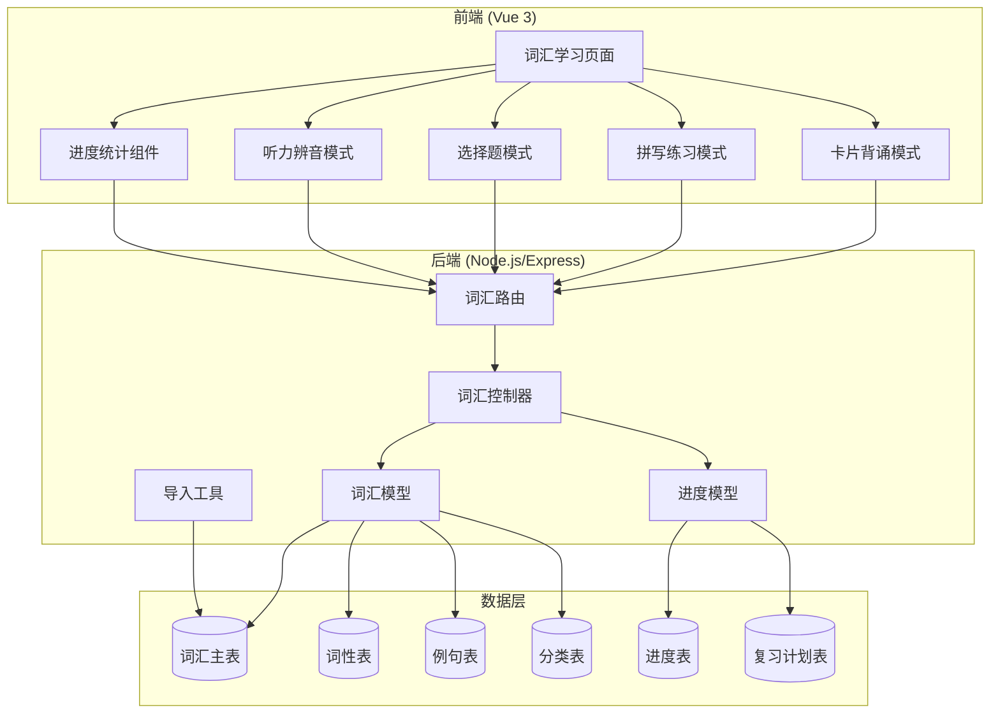
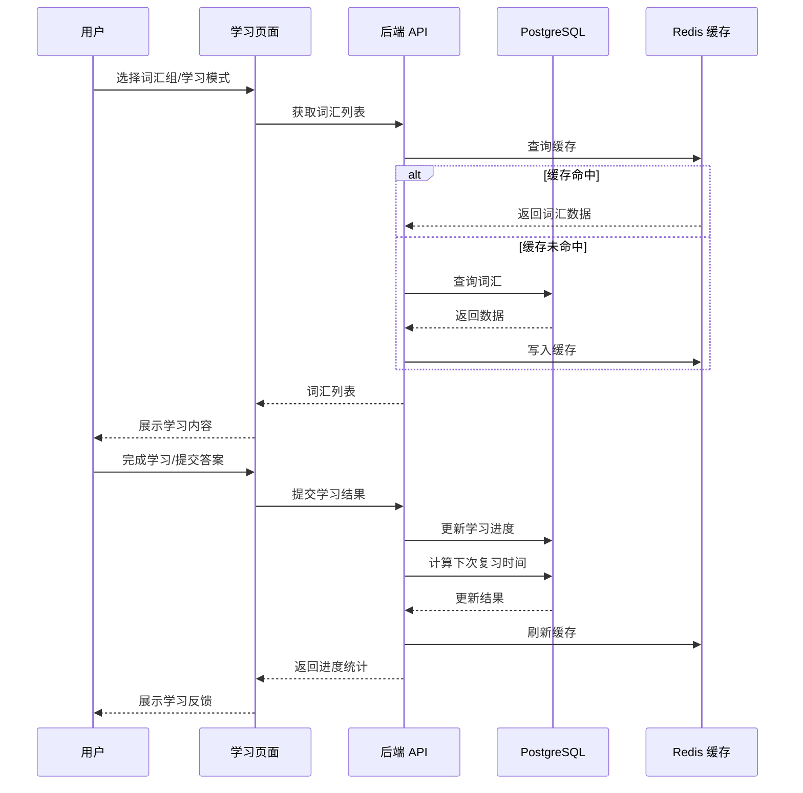
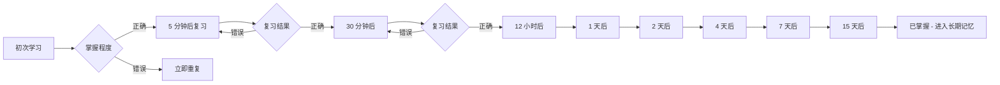

# 词汇学习系统升级技术设计

Feature Name: vocabulary-system-upgrade
Updated: 2026-05-24

## Description

本设计文档定义 EnglishAI 平台词汇学习系统的全面升级方案，包括 6000 词汇库的数据库设计、多维度分组策略、四种学习模式的实现方案、学习进度追踪系统和相关 API 接口。设计基于艾宾浩斯记忆曲线和现代语言学习理论，提供科学、高效的词汇学习体验。

## Architecture

### 系统架构图



### 数据流向



### 艾宾浩斯记忆曲线算法



## Components and Interfaces

### 1. 后端组件

#### 1.1 词汇控制器 (`controllers/vocabulary.controller.ts`)

```typescript
interface VocabularyController {
  // 词汇组管理
  getGroups(req: Request): Promise<Response>;
  getGroupById(req: Request): Promise<Response>;
  getWordsInGroup(req: Request): Promise<Response>;
  
  // 词汇详情
  getWordDetail(req: Request): Promise<Response>;
  searchWords(req: Request): Promise<Response>;
  
  // 学习行为记录
  recordLearning(req: Request): Promise<Response>;
  recordReview(req: Request): Promise<Response>;
  submitPractice(req: Request): Promise<Response>;
  
  // 进度统计
  getProgress(req: Request): Promise<Response>;
  getDueReviews(req: Request): Promise<Response>;
  getStatistics(req: Request): Promise<Response>;
}
```

#### 1.2 词汇模型 (`models/Vocabulary.model.ts`)

```typescript
interface Word {
  id: number;
  word: string;                    // 单词拼写
  phoneticUk: string;              // 英式音标
  phoneticUs: string;              // 美式音标
  difficultyLevel: number;         // 难度等级 1-10
  frequencyLevel: 'high' | 'medium' | 'low';
  createdAt: Date;
}

interface WordPos {
  id: number;
  wordId: number;
  pos: string;                     // noun, verb, adjective...
  definitionCn: string[];          // 中文释义数组
  definitionEn: string;            // 英文释义
  rootAffix?: string;              // 词根词缀
  memoryTip?: string;              // 助记提示
}

interface WordSentence {
  id: number;
  wordId: number;
  sentenceEn: string;              // 英文例句
  sentenceCn: string;              // 中文翻译
  audioUrl?: string;               // 例句音频
}

interface WordCategory {
  id: number;
  wordId: number;
  categoryType: 'theme' | 'exam' | 'pos' | 'stage';
  categoryValue: string;           // 具体分类值
  isPrimary: boolean;              // 是否主要分类
}

interface UserWordProgress {
  userId: number;
  wordId: number;
  status: 'new' | 'learning' | 'mastered' | 'review';
  learnedTimes: number;            // 学习次数
  errorTimes: number;              // 错误次数
  lastLearnedAt: Date;             // 最后学习时间
  nextReviewAt?: Date;             // 下次复习时间
  masteryLevel: number;            // 掌握程度 0-100
}
```

#### 1.3 词汇导入工具 (`utils/vocabulary-importer.ts`)

```typescript
interface VocabularyImporter {
  // 支持的数据源格式
  importFromJson(filePath: string): Promise<ImportResult>;
  importFromCsv(filePath: string): Promise<ImportResult>;
  importFromExcel(filePath: string): Promise<ImportResult>;
  
  // 导入验证
  validateData(data: RawWordData[]): ValidationResult;
  detectDuplicates(data: RawWordData[]): Promise<string[]>;
  
  // 批量导入
  batchInsert(data: RawWordData[], batchSize?: number): Promise<ImportResult>;
  
  // 进度追踪
  getImportProgress(importId: string): ImportProgress;
  rollback(importId: string): Promise<void>;
}

interface ImportResult {
  success: boolean;
  totalRecords: number;
  importedRecords: number;
  skippedRecords: number;
  errorRecords: number;
  errors: ImportError[];
}
```

### 2. 前端组件

#### 2.1 词汇学习页面 (`pages/VocabularyLearning.vue`)

```vue
<template>
  <div class="vocabulary-learning-page">
    <!-- 学习模式选择 -->
    <ModeSelector 
      :modes="learningModes" 
      @select="selectMode" 
    />
    
    <!-- 词汇组选择和进度展示 -->
    <GroupSelector 
      :groups="vocabularyGroups"
      :user-progress="progress"
      @select="selectGroup"
    />
    
    <!-- 学习区域 -->
    <LearningArea 
      v-if="selectedMode"
      :mode="selectedMode"
      :words="currentWords"
      :group-id="selectedGroupId"
      @complete="handleComplete"
      @progress-update="updateProgress"
    />
    
    <!-- 统计面板 -->
    <StatisticsPanel :stats="learningStats" />
  </div>
</template>
```

#### 2.2 卡片背诵组件 (`components/vocabulary/CardMode.vue`)

```typescript
interface CardModeProps {
  words: WordDetail[];
  groupId: number;
  shuffle?: boolean;
}

interface CardModeEmits {
  'complete': (result: LearningResult) => void;
  'progress-update': (progress: LearningProgress) => void;
}

// 卡片状态
interface CardState {
  currentIndex: number;
  isFlipped: boolean;
  knownWords: number[];
  unknownWords: number[];
  learnedCount: number;
}
```

#### 2.3 拼写练习组件 (`components/vocabulary/SpellingMode.vue`)

```typescript
interface SpellingModeProps {
  words: WordDetail[];
  showAudio?: boolean;
  showMeaning?: boolean;
  maxAttempts?: number;
}

interface SpellingState {
  currentWordIndex: number;
  userInput: string;
  attempts: number;
  correctCount: number;
  incorrectWords: Array<{
    word: string;
    userSpelling: string;
    correctSpelling: string;
  }>;
}
```

#### 2.4 选择题组件 (`components/vocabulary/ChoiceMode.vue`)

```typescript
interface ChoiceModeProps {
  words: WordDetail[];
  questionType: 'word-to-meaning' | 'meaning-to-word';
  optionsCount?: number;  // 默认 4
}

interface ChoiceQuestion {
  wordId: number;
  question: string;       // 题干
  correctAnswer: string;  // 正确答案
  options: string[];      // 所有选项
  explanation: string;    // 答案解析
}
```

#### 2.5 听力辨音组件 (`components/vocabulary/ListeningMode.vue`)

```typescript
interface ListeningModeProps {
  words: WordDetail[];
  accent?: 'uk' | 'us' | 'both';
  maxPlays?: number;      // 最大播放次数
}

interface ListeningState {
  currentWordIndex: number;
  audioPlayCount: number;
  currentAudioUrl: string;
  isPlaying: boolean;
  answers: Array<{
    wordId: number;
    userChoice: string;
    correct: boolean;
  }>;
}
```

### 3. API 接口定义

```typescript
interface VocabularyAPI {
  // 词汇组相关
  getGroups(): Promise<ApiResponse<VocabularyGroup[]>>;
  getWordsInGroup(groupId: number, page?: number, limit?: number): Promise<ApiResponse<PaginatedWords>>;
  
  // 词汇详情
  getWordDetail(wordId: number): Promise<ApiResponse<WordDetail>>;
  searchWords(query: string, filters?: SearchFilters): Promise<ApiResponse<WordSearchResult>>;
  
  // 学习行为
  recordLearning(wordId: number, action: LearnAction): Promise<ApiResponse<LearningRecord>>;
  recordReview(wordId: number, result: ReviewResult): Promise<ApiResponse<ReviewRecord>>;
  submitPractice(practiceData: PracticeSubmission): Promise<ApiResponse<PracticeResult>>;
  
  // 进度统计
  getProgress(): Promise<ApiResponse<UserProgress>>;
  getDueReviews(date?: string): Promise<ApiResponse<DueReview[]>>;
  getStatistics(timeRange?: TimeRange): Promise<ApiResponse<LearningStatistics>>;
}

// 数据结构
interface VocabularyGroup {
  id: number;
  name: string;
  description: string;
  categoryType: 'theme' | 'exam' | 'pos' | 'stage';
  wordCount: number;
  learnedCount: number;
  masteryRate: number;
}

interface WordDetail extends Word, WordPos {
  sentences: WordSentence[];
  synonyms: string[];
  antonyms: string[];
  categories: WordCategory[];
  audio: {
    uk: string;
    us: string;
  };
}

interface LearningResult {
  groupId: number;
  learnedWords: number;
  knownWords: number;
  unknownWords: number;
  timeSpent: number;      // 秒
  completedAt: string;
}
```

## Data Models

### 数据库表结构

#### 1. 词汇主表 (words)

```sql
CREATE TABLE words (
  id SERIAL PRIMARY KEY,
  word VARCHAR(100) NOT NULL UNIQUE,
  phonetic_uk VARCHAR(100),
  phonetic_us VARCHAR(100),
  difficulty_level SMALLINT CHECK (difficulty_level BETWEEN 1 AND 10),
  frequency_level VARCHAR(20) CHECK (frequency_level IN ('high', 'medium', 'low')),
  created_at TIMESTAMP DEFAULT CURRENT_TIMESTAMP,
  updated_at TIMESTAMP DEFAULT CURRENT_TIMESTAMP,
  
  -- 索引
  INDEX idx_word (word),
  INDEX idx_difficulty (difficulty_level),
  INDEX idx_frequency (frequency_level)
);
```

#### 2. 词性表 (word_pos)

```sql
CREATE TABLE word_pos (
  id SERIAL PRIMARY KEY,
  word_id INTEGER NOT NULL REFERENCES words(id) ON DELETE CASCADE,
  pos VARCHAR(50) NOT NULL,
  definition_cn TEXT NOT NULL,  -- JSON 数组存储多个中文释义
  definition_en TEXT,
  root_affix TEXT,
  memory_tip TEXT,
  created_at TIMESTAMP DEFAULT CURRENT_TIMESTAMP,
  
  INDEX idx_word_id (word_id),
  INDEX idx_pos (pos)
);
```

#### 3. 例句表 (word_sentences)

```sql
CREATE TABLE word_sentences (
  id SERIAL PRIMARY KEY,
  word_id INTEGER NOT NULL REFERENCES words(id) ON DELETE CASCADE,
  sentence_en TEXT NOT NULL,
  sentence_cn TEXT NOT NULL,
  audio_url VARCHAR(500),
  created_at TIMESTAMP DEFAULT CURRENT_TIMESTAMP,
  
  INDEX idx_word_id (word_id)
);
```

#### 4. 同义词/反义词关系表

```sql
CREATE TABLE word_relations (
  id SERIAL PRIMARY KEY,
  word_id INTEGER NOT NULL REFERENCES words(id) ON DELETE CASCADE,
  related_word_id INTEGER NOT NULL REFERENCES words(id) ON DELETE CASCADE,
  relation_type VARCHAR(20) CHECK (relation_type IN ('synonym', 'antonym')),
  similarity_score DECIMAL(3,2),  -- 同义词相似度 0-1
  created_at TIMESTAMP DEFAULT CURRENT_TIMESTAMP,
  
  UNIQUE KEY unique_relation (word_id, related_word_id, relation_type),
  INDEX idx_word_id (word_id),
  INDEX idx_related_word_id (related_word_id)
);
```

#### 5. 词汇分类表 (word_categories)

```sql
CREATE TABLE word_categories (
  id SERIAL PRIMARY KEY,
  word_id INTEGER NOT NULL REFERENCES words(id) ON DELETE CASCADE,
  category_type VARCHAR(50) NOT NULL,  -- theme, exam, pos, stage
  category_value VARCHAR(100) NOT NULL,
  is_primary BOOLEAN DEFAULT FALSE,
  created_at TIMESTAMP DEFAULT CURRENT_TIMESTAMP,
  
  INDEX idx_word_id (word_id),
  INDEX idx_category (category_type, category_value)
);
```

#### 6. 用户词汇进度表 (user_word_progress)

```sql
CREATE TABLE user_word_progress (
  id SERIAL PRIMARY KEY,
  user_id INTEGER NOT NULL REFERENCES users(id) ON DELETE CASCADE,
  word_id INTEGER NOT NULL REFERENCES words(id) ON DELETE CASCADE,
  status VARCHAR(20) CHECK (status IN ('new', 'learning', 'mastered', 'review')),
  learned_times INTEGER DEFAULT 0,
  error_times INTEGER DEFAULT 0,
  last_learned_at TIMESTAMP,
  next_review_at TIMESTAMP,
  mastery_level SMALLINT CHECK (mastery_level BETWEEN 0 AND 100),
  created_at TIMESTAMP DEFAULT CURRENT_TIMESTAMP,
  updated_at TIMESTAMP DEFAULT CURRENT_TIMESTAMP,
  
  UNIQUE KEY unique_user_word (user_id, word_id),
  INDEX idx_user_id (user_id),
  INDEX idx_word_id (word_id),
  INDEX idx_status (status),
  INDEX idx_next_review (next_review_at)
);
```

#### 7. 学习记录表 (learning_records)

```sql
CREATE TABLE learning_records (
  id SERIAL PRIMARY KEY,
  user_id INTEGER NOT NULL REFERENCES users(id) ON DELETE CASCADE,
  word_id INTEGER NOT NULL REFERENCES words(id) ON DELETE CASCADE,
  action_type VARCHAR(50) NOT NULL,  -- learn, review, practice_spelling, practice_choice, practice_listening
  is_correct BOOLEAN,
  time_spent INTEGER,  -- 秒
  metadata JSONB,      -- 额外数据（如错误答案、使用的提示等）
  created_at TIMESTAMP DEFAULT CURRENT_TIMESTAMP,
  
  INDEX idx_user_id (user_id),
  INDEX idx_word_id (word_id),
  INDEX idx_created_at (created_at)
);
```

### 艾宾浩斯复习时间算法实现

```typescript
// 艾宾浩斯记忆曲线复习间隔（分钟）
const REVIEW_INTERVALS = [
  5,      // 初次学习后 5 分钟
  30,     // 30 分钟
  720,    // 12 小时
  1440,   // 1 天
  2880,   // 2 天
  5760,   // 4 天
  10080,  // 7 天
  21600   // 15 天
];

interface ReviewScheduler {
  /**
   * 计算下次复习时间
   * @param learningTimes 已学习次数
   * @param isCorrect 本次是否正确
   * @returns 下次复习时间（Date）
   */
  calculateNextReview(learningTimes: number, isCorrect: boolean): Date {
    if (!isCorrect) {
      // 错误则立即重复（5 分钟后）
      return new Date(Date.now() + 5 * 60 * 1000);
    }
    
    if (learningTimes >= REVIEW_INTERVALS.length) {
      // 已掌握，不需要复习
      return null;
    }
    
    const intervalMinutes = REVIEW_INTERVALS[learningTimes];
    return new Date(Date.now() + intervalMinutes * 60 * 1000);
  }
  
  /**
   * 获取待复习词汇
   * @param userId 用户 ID
   * @param date 日期（默认今天）
   * @returns 待复习词汇列表
   */
  async getDueReviews(userId: number, date: Date = new Date()): Promise<Word[]> {
    const startOfDay = new Date(date.setHours(0, 0, 0, 0));
    const endOfDay = new Date(date.setHours(23, 59, 59, 999));
    
    return await pool.query(`
      SELECT w.*
      FROM user_word_progress uwp
      JOIN words w ON uwp.word_id = w.id
      WHERE uwp.user_id = $1
        AND uwp.next_review_at IS NOT NULL
        AND uwp.next_review_at >= $2
        AND uwp.next_review_at <= $3
        AND uwp.status != 'mastered'
      ORDER BY uwp.next_review_at ASC
    `, [userId, startOfDay, endOfDay]);
  }
}
```

## Correctness Properties

### 不变量

1. **词汇唯一性**: `words` 表中 `word` 字段全剧唯一（不区分大小写）
2. **进度一致性**: 用户词汇进度状态必须与学习记录一致
3. **复习时间有效性**: `next_review_at` 字段必须大于 `last_learned_at`
4. **掌握度边界**: `mastery_level` 必须在 0-100 范围内
5. **外键完整性**: 所有子表的外键引用必须存在

### 边界条件

1. **并发学习**: 同一用户同时对同一词汇进行学习时，使用数据库事务保证进度更新的一致性
2. **时区处理**: 所有时间戳使用 UTC 存储，前端转换为本地时区
3. **音频回退**: 当美音音频不存在时，自动使用英音；都失败时隐藏音频按钮
4. **大数据量**: 词汇列表分页加载，每页最大 100 条，支持虚拟滚动

### 性能约束

1. **查询缓存**: 词汇详情查询结果缓存 1 小时，词汇列表缓存 10 分钟
2. **索引优化**: 所有频繁查询字段建立复合索引
3. **批量操作**: 导入工具使用批量插入（每批 500 条），避免单条插入性能问题
4. **异步处理**: 学习记录异步写入，不阻塞用户操作

## Error Handling

### 错误场景和处理

```typescript
// 词汇不存在
GET /api/vocabulary/words/999999
Response: {
  success: false,
  error: {
    code: 'RESOURCE_NOT_FOUND',
    message: '词汇不存在',
    details: { wordId: 999999 }
  }
}

// 词汇组不存在
GET /api/vocabulary/groups/999999/words
Response: {
  success: false,
  error: {
    code: 'RESOURCE_NOT_FOUND',
    message: '词汇组不存在',
    details: { groupId: 999999 }
  }
}

// 提交数据验证失败
POST /api/vocabulary/practice/spelling
Request: { wordId: 123, answer: '' }  // 空答案
Response: {
  success: false,
  error: {
    code: 'VALIDATION_FAILED',
    message: '验证失败',
    details: {
      answer: '答案不能为空'
    }
  }
}

// 数据库错误
Response: {
  success: false,
  error: {
    code: 'SYSTEM_DATABASE_ERROR',
    message: '数据库操作失败，请稍后重试'
  }
}
```

### 导入工具错误处理

```typescript
interface ImportError {
  rowNumber: number;
  field: string;
  errorType: 'missing_field' | 'invalid_format' | 'duplicate' | 'constraint_violation';
  message: string;
  value: any;
}

// 导入验证
function validateWordData(data: RawWordData[]): ValidationResult {
  const errors: ImportError[] = [];
  
  data.forEach((row, index) => {
    // 必填字段检查
    if (!row.word) {
      errors.push({
        rowNumber: index + 1,
        field: 'word',
        errorType: 'missing_field',
        message: '词汇拼写为必填项',
        value: row.word
      });
    }
    
    // 格式检查
    if (row.word && !/^[a-zA-Z\-']+$/.test(row.word)) {
      errors.push({
        rowNumber: index + 1,
        field: 'word',
        errorType: 'invalid_format',
        message: '词汇只能包含字母、连字符和撇号',
        value: row.word
      });
    }
    
    // 难度等级检查
    if (row.difficultyLevel && (row.difficultyLevel < 1 || row.difficultyLevel > 10)) {
      errors.push({
        rowNumber: index + 1,
        field: 'difficultyLevel',
        errorType: 'invalid_format',
        message: '难度等级必须在 1-10 之间',
        value: row.difficultyLevel
      });
    }
  });
  
  return {
    isValid: errors.length === 0,
    errors,
    validCount: data.length - errors.length
  };
}
```

## Test Strategy

### 测试覆盖

```
测试金字塔:
                    /\
                   /  \
                  / E2E \        端到端测试 (10%)
                 /--------\
                /          \
               /   集成      \      集成测试 (20%)
              /--------------\
             /                \
            /     单元测试      \    单元测试 (70%)
           /--------------------\
```

### 单元测试 (vitest)

```typescript
// vocabulary.controller.test.ts
describe('VocabularyController', () => {
  describe('getWordDetail', () => {
    it('should return word detail with all related data', async () => {
      // Arrange
      const mockWord = createMockWord();
      vi.spyOn(VocabularyModel, 'findById').mockResolvedValue(mockWord);
      
      // Act
      const result = await getWordDetail(mockRequest, mockResponse);
      
      // Assert
      expect(result.data).toHaveProperty('word');
      expect(result.data).toHaveProperty('phoneticUk');
      expect(result.data).toHaveProperty('sentences');
      expect(result.data).toHaveProperty('synonyms');
    });
    
    it('should return 404 when word not found', async () => {
      // Arrange
      vi.spyOn(VocabularyModel, 'findById').mockResolvedValue(null);
      
      // Act
      await getWordDetail(mockRequest, mockResponse);
      
      // Assert
      expect(mockResponse.status).toHaveBeenCalledWith(404);
    });
  });
});

// ebbinghaus.test.ts
describe('EbbinghausReviewScheduler', () => {
  it('should schedule next review after 5 minutes for first learning', () => {
    const nextReview = scheduler.calculateNextReview(0, true);
    const expectedTime = new Date(Date.now() + 5 * 60 * 1000);
    expect(nextReview.getTime()).toBeCloseTo(expectedTime.getTime(), -2);
  });
  
  it('should reschedule after incorrect answer', () => {
    const nextReview = scheduler.calculateNextReview(3, false);
    const expectedTime = new Date(Date.now() + 5 * 60 * 1000);
    expect(nextReview.getTime()).toBeCloseTo(expectedTime.getTime(), -2);
  });
  
  it('should return null when mastered', () => {
    const nextReview = scheduler.calculateNextReview(8, true);
    expect(nextReview).toBeNull();
  });
});
```

### 集成测试

```typescript
// vocabulary.integration.test.ts
describe('Vocabulary API Integration', () => {
  beforeAll(async () => {
    await setupTestDatabase();
    await importTestVocabulary();
  });
  
  afterAll(async () => {
    await cleanupTestDatabase();
  });
  
  it('should complete vocabulary learning flow', async () => {
    // 1. 获取词汇组列表
    const groupsRes = await request(app)
      .get('/api/vocabulary/groups')
      .set('Authorization', `Bearer ${testToken}`);
    
    expect(groupsRes.status).toBe(200);
    expect(groupsRes.body.data).toHaveLength(10);
    
    // 2. 获取词汇组下的词汇
    const wordsRes = await request(app)
      .get('/api/vocabulary/groups/1/words')
      .set('Authorization', `Bearer ${testToken}`);
    
    expect(wordsRes.status).toBe(200);
    expect(wordsRes.body.data.words).toBeDefined();
    
    // 3. 获取词汇详情
    const wordId = wordsRes.body.data.words[0].id;
    const detailRes = await request(app)
      .get(`/api/vocabulary/words/${wordId}`)
      .set('Authorization', `Bearer ${testToken}`);
    
    expect(detailRes.status).toBe(200);
    expect(detailRes.body.data.sentences).toBeDefined();
    
    // 4. 记录学习
    const learnRes = await request(app)
      .post(`/api/vocabulary/words/${wordId}/learn`)
      .send({ action: 'start' })
      .set('Authorization', `Bearer ${testToken}`);
    
    expect(learnRes.status).toBe(200);
    
    // 5. 检查学习进度
    const progressRes = await request(app)
      .get('/api/vocabulary/progress')
      .set('Authorization', `Bearer ${testToken}`);
    
    expect(progressRes.status).toBe(200);
    expect(progressRes.data.learnedCount).toBeGreaterThan(0);
  });
});
```

### 前端组件测试

```typescript
// CardMode.test.ts
import { mount } from '@vue/test-utils';
import CardMode from '@/components/vocabulary/CardMode.vue';

describe('CardMode', () => {
  it('should display word on card front', () => {
    const wrapper = mount(CardMode, {
      props: {
        words: [mockWord],
        groupId: 1
      }
    });
    
    expect(wrapper.text()).toContain(mockWord.word);
    expect(wrapper.text()).toContain(mockWord.phoneticUk);
  });
  
  it('should flip card on click', async () => {
    const wrapper = mount(CardMode, {
      props: { words: [mockWord], groupId: 1 }
    });
    
    await wrapper.find('.card').trigger('click');
    
    expect(wrapper.classes()).toContain('flipped');
  });
  
  it('should emit complete event when all words learned', async () => {
    const wrapper = mount(CardMode, {
      props: { words: [mockWord], groupId: 1 }
    });
    
    await wrapper.find('[data-testid="known-btn"]').trigger('click');
    
    expect(wrapper.emitted('complete')).toBeDefined();
  });
});
```

### 测试数据准备

```typescript
// test/fixtures/vocabulary.ts
export function createMockWord(): WordDetail {
  return {
    id: 1,
    word: 'abandon',
    phoneticUk: '[əˈbændən]',
    phoneticUs: '[əˈbændən]',
    difficultyLevel: 5,
    frequencyLevel: 'high',
    pos: 'verb',
    definitionCn: ['遗弃；抛弃；放弃'],
    definitionEn: 'to leave someone or something behind',
    sentences: [
      {
        id: 1,
        sentenceEn: 'He abandoned his car in the snow.',
        sentenceCn: '他在雪地里弃车而去。'
      }
    ],
    synonyms: ['desert', 'forsake', 'leave'],
    antonyms: ['keep', 'retain'],
    categories: [
      { categoryType: 'theme', categoryValue: 'daily-conversation' },
      { categoryType: 'exam', categoryValue: 'CET-6' }
    ]
  };
}
```

## References

[^1]: (艾宾浩斯记忆曲线) - [Ebbinghaus Forgetting Curve](https://en.wikipedia.org/wiki/Forgetting_curve)
[^2]: (词汇学习理论) - [Nation, I.S.P. (2001). Learning Vocabulary in Another Language](https://www.cambridge.org/core/books/learning-vocabulary-in-another-language/)
[^3]: (音标标准) - [IPA - International Phonetic Alphabet](https://www.ipachart.com/)
[^4]: (CET-6 词汇大纲) - [大学英语六级考试大纲](http://www.cet.net.cn/)
[^5]: (Vitest Testing) - [Vitest Documentation](https://vitest.dev/)
